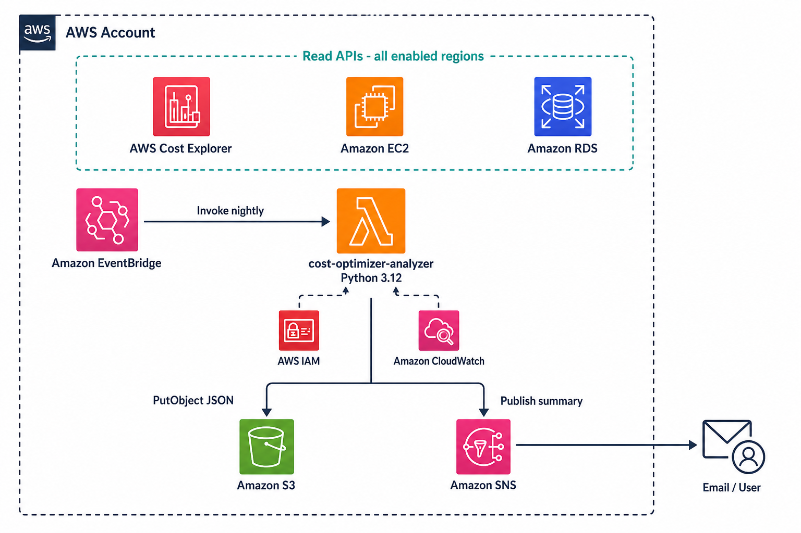
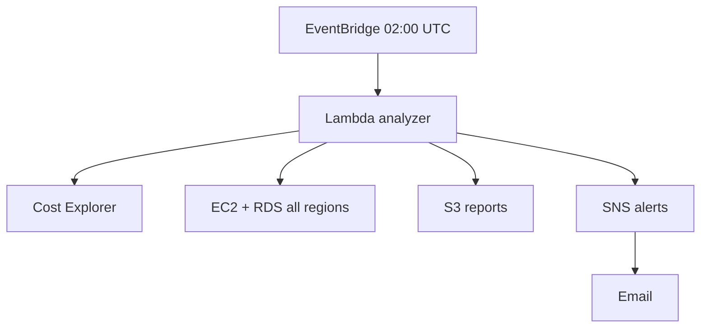

# AWS Event-Driven Cost Optimizer

A nightly, event-driven system that analyzes AWS spending and surfaces cost optimization opportunities across your entire account. Built with **Python Lambda**, **EventBridge**, **S3**, **SNS**, and **modular Terraform**.

## Overview

Every night at **02:00 UTC**, an EventBridge schedule invokes a Lambda function that:

1. Pulls **account-wide** spend from **AWS Cost Explorer** (yesterday, MTD, 7-day trend, top services, week-over-week delta)
2. Discovers **all enabled AWS regions** via `ec2:DescribeRegions`
3. Scans each region for waste: unattached EBS, unused EIPs, long-stopped EC2, old snapshots, stopped RDS
4. Writes a timestamped **JSON report** to S3
5. Sends an **email summary** via SNS

Cost data is account-wide. Recommendation scans run per region with isolated error handling — a failure in one region does not stop the rest.

## Architecture diagram



| Asset | Use |
|-------|-----|
| [docs/aws-cost-optimizer-architecture.drawio](docs/aws-cost-optimizer-architecture.drawio) | **Best quality** — open in [diagrams.net](https://app.diagrams.net), official AWS icons, editable |
| [docs/aws-cost-optimizer-hq.png](docs/aws-cost-optimizer-hq.png) | Ready-to-share PNG (LinkedIn, README) |
| [docs/architecture.md](docs/architecture.md) | Mermaid diagrams + data-flow table |



## Terraform modules

| Module | Resources |
|--------|-----------|
| `modules/s3` | Private encrypted bucket, public access blocked, 90-day report expiration |
| `modules/sns` | Topic + email subscription |
| `modules/lambda` | Python 3.12 function, IAM role, CloudWatch log group, zip packaging |
| `modules/eventbridge` | Schedule rule, Lambda target, invoke permission |

## Lambda application

```
lambda/src/
├── handler.py           # Orchestrates the nightly run
├── cost_explorer.py     # Account-wide spend queries (CE endpoint: us-east-1)
├── regions.py           # Discovers enabled regions
├── recommendations.py   # Per-region waste scans + multi-region aggregator
├── report_builder.py    # JSON report assembly
└── config.py            # Environment-driven thresholds
```

### Recommendation checks

| Check | API | Severity |
|-------|-----|----------|
| Unattached EBS | `ec2:DescribeVolumes` | medium |
| Unused Elastic IP | `ec2:DescribeAddresses` | low |
| Long-stopped EC2 | `ec2:DescribeInstances` | medium |
| Old snapshots | `ec2:DescribeSnapshots` | low |
| Stopped RDS | `rds:DescribeDBInstances` | medium |

Estimated savings in the report are rough heuristics, not billing-grade figures.

## Prerequisites

1. **AWS CLI** configured with credentials for the target account
2. **Terraform** >= 1.5
3. **Cost Explorer enabled** in the AWS Billing console (one-time, free)
4. IAM permissions to create Lambda, IAM roles, S3, SNS, and EventBridge resources

## Project structure

```
Eventdriven/
├── README.md
├── lambda/
│   ├── src/              # Lambda source code
│   ├── tests/            # Unit tests
│   └── requirements.txt  # Dev/test dependencies
└── terraform/
    ├── modules/          # s3, sns, lambda, eventbridge
    └── environments/
        └── prod/         # Production wiring + variables
```

## Deploy

```bash
cd terraform/environments/prod
cp terraform.tfvars.example terraform.tfvars
# Edit terraform.tfvars — set notification_email and aws_region

terraform init
terraform plan
terraform apply
```

### Confirm SNS subscription

After `terraform apply`, AWS sends a confirmation email to `notification_email`. Click **Confirm subscription** before the first nightly run; otherwise SNS will not deliver alerts.

### Manual test

```bash
aws lambda invoke \
  --function-name cost-optimizer-analyzer \
  --region us-east-1 \
  out.json

cat out.json
```

Verify:

- A new JSON object under `s3://<bucket>/reports/YYYY/MM/DD/`
- `regions_scanned` lists all enabled regions in the report
- An email notification with spend summary and top findings

## Configuration

| Variable | Default | Description |
|----------|---------|-------------|
| `aws_region` | `us-east-1` | Region where Lambda, S3, SNS, and EventBridge are deployed |
| `project_name` | `cost-optimizer` | Resource name prefix |
| `notification_email` | *(required)* | SNS email recipient |
| `snapshot_age_days` | `90` | Flag snapshots older than N days |
| `stopped_instance_days` | `7` | Flag EC2 stopped longer than N days |
| `report_retention_days` | `90` | S3 lifecycle expiration for reports |
| `schedule_expression` | `cron(0 2 * * ? *)` | Nightly at 02:00 UTC |

## Report schema

Reports are stored at `reports/YYYY/MM/DD/cost-report-{timestamp}.json`:

```json
{
  "report_id": "uuid",
  "generated_at": "ISO8601",
  "account_id": "123456789012",
  "cost_summary": {
    "mtd_usd": 0,
    "yesterday_usd": 0,
    "daily_series": [],
    "top_services": [],
    "wow_change_pct": 0
  },
  "regions_scanned": ["ap-southeast-1", "eu-west-1", "us-east-1"],
  "recommendations": [
    {
      "category": "unattached_ebs",
      "severity": "medium",
      "resource_id": "vol-abc123",
      "region": "us-east-1",
      "description": "EBS volume vol-abc123 (100 GB) is unattached",
      "estimated_monthly_savings": 10.0
    }
  ],
  "totals": {
    "finding_count": 1,
    "estimated_monthly_savings_usd": 10.0,
    "regions_scanned_count": 3
  },
  "errors": []
}
```

## Local tests

```bash
cd lambda
pip install -r requirements.txt
pytest tests/ -v
```

## Terraform outputs

After apply:

| Output | Description |
|--------|-------------|
| `report_bucket_name` | S3 bucket for JSON reports |
| `sns_topic_arn` | SNS topic for alerts |
| `lambda_function_name` | Function to invoke manually |
| `eventbridge_rule_name` | Nightly schedule rule |

## Estimated cost

~$0–2/month for a single-account nightly run (Lambda free tier, minimal S3/SNS usage). Cost Explorer API calls have no per-call charge.
