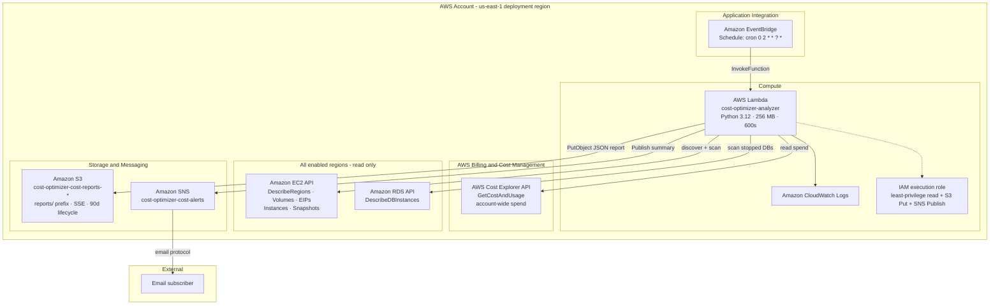
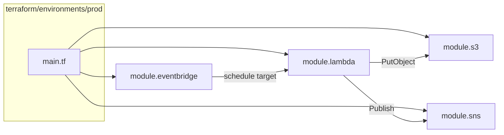
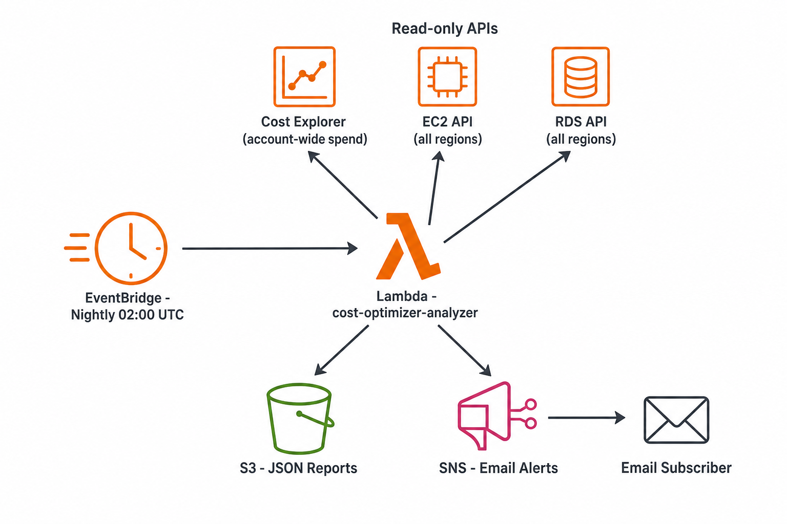

# Architecture

## High-quality diagram (recommended)

### Option A — Editable draw.io (official AWS icons)

Open in **[diagrams.net](https://app.diagrams.net)**:

```
docs/aws-cost-optimizer-architecture.drawio
```

Uses the **AWS Architecture Icons (aws4)** shape library built into draw.io. Export as PNG or SVG at 2x scale for LinkedIn/README.

### Option B — Ready-made PNG


File: `docs/aws-cost-optimizer-hq.png`

---

## Logical architecture (AWS-style)

This is the recommended view for documentation, LinkedIn, and interviews. It groups services the way AWS Well-Architected diagrams do: **schedule → compute → read APIs → outputs**.



## Data flow

| Step | From | To | What happens |
|------|------|-----|--------------|
| 1 | EventBridge | Lambda | Nightly trigger at 02:00 UTC |
| 2 | Lambda | Cost Explorer | Yesterday, MTD, 7-day trend, top services |
| 3 | Lambda | EC2 `DescribeRegions` | List enabled regions |
| 4 | Lambda | EC2 + RDS (per region) | Waste checks with per-region error isolation |
| 5 | Lambda | S3 | Upload `reports/YYYY/MM/DD/cost-report-*.json` |
| 6 | Lambda | SNS | Email with spend headline + top 5 findings + S3 URI |

## Terraform infrastructure map



## Build a professional diagram (official AWS icons)

For portfolio posts, README hero images, or slide decks, use **official AWS Architecture Icons** — not generic clip art.

### Official resources

| Resource | URL | Best for |
|----------|-----|----------|
| **AWS Architecture Icons** (official, free) | https://aws.amazon.com/architecture/icons/ | PowerPoint, draw.io, Figma, Lucidchart |
| **AWS Well-Architected Framework** | https://aws.amazon.com/architecture/well-architected/ | Design principles + lens for cost optimization |
| **AWS Serverless patterns** | https://serverlessland.com/patterns | Similar EventBridge → Lambda reference patterns |
| **AWS Prescriptive Guidance – diagrams** | https://docs.aws.amazon.com/prescriptive-guidance/latest/architecture-diagrams/introduction.html | How AWS expects diagrams to be structured |

### Recommended free tools

| Tool | URL | Notes |
|------|-----|-------|
| **draw.io (diagrams.net)** | https://app.diagrams.net | Import AWS 4/5 icon packs; most common for GitHub projects |
| **Lucidchart AWS shapes** | https://www.lucidchart.com | Polished exports; AWS shape library built in |
| **Cloudcraft** | https://www.cloudcraft.co | 3D isometric AWS diagrams from live or manual layout |
| **AWS Application Composer** | https://docs.aws.amazon.com/serverless-application-model/latest/developerguide/what-is-application-composer.html | Visual serverless editor (SAM); good for Lambda-centric apps |

### Suggested layout (for draw.io)

Place icons left → right:

1. **EventBridge** (scheduler icon)
2. Arrow → **Lambda** (with small **IAM role** and **CloudWatch** underneath)
3. From Lambda, upward arrows to:
   - **Cost Explorer** (Billing category)
   - **EC2** + **RDS** (group label: “All enabled regions”)
4. From Lambda, downward arrows to:
   - **S3** (report bucket)
   - **SNS** → **Email** (external/user icon)

Use one dashed **AWS Account** boundary around everything except the email subscriber.

### Icon names to search in the AWS icon set

- Amazon EventBridge
- AWS Lambda
- AWS Identity and Access Management (IAM)
- Amazon CloudWatch
- AWS Cost Explorer
- Amazon EC2
- Amazon RDS
- Amazon Simple Storage Service (S3)
- Amazon Simple Notification Service (SNS)
- Email / User (generic or AWS User icon)

## Simple diagram (quick reference)



*The PNG above is a quick visual. For a production-quality diagram, rebuild using the official icon pack and layout above.*
